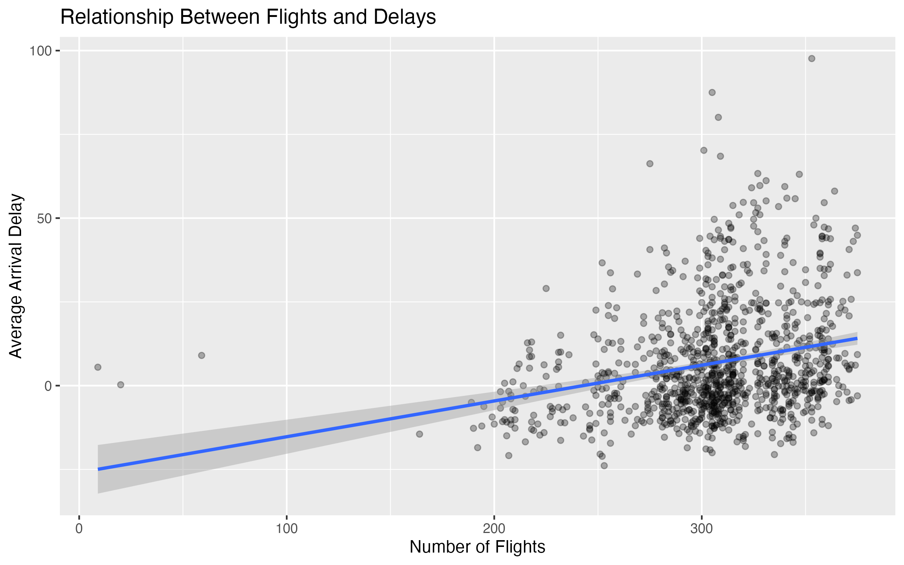

# airline-delay-panel-analysis
Investigating whether busier airports experience more delays.
## Results

We estimate the relationship between airport traffic and delays using panel data methods.

### Main Result (Two-Way Fixed Effects)

A one-unit increase in the number of flights is associated with approximately **0.10 minutes increase in average arrival delay**, controlling for airport and date fixed effects.

This implies that:

- 10 additional flights → ~1 extra minute of delay

### Interpretation

This suggests that increased airport traffic contributes to congestion, leading to higher delays even after accounting for airport-specific characteristics and daily shocks.

## Visualization

The figure below shows the positive relationship between airport traffic and average arrival delays.
